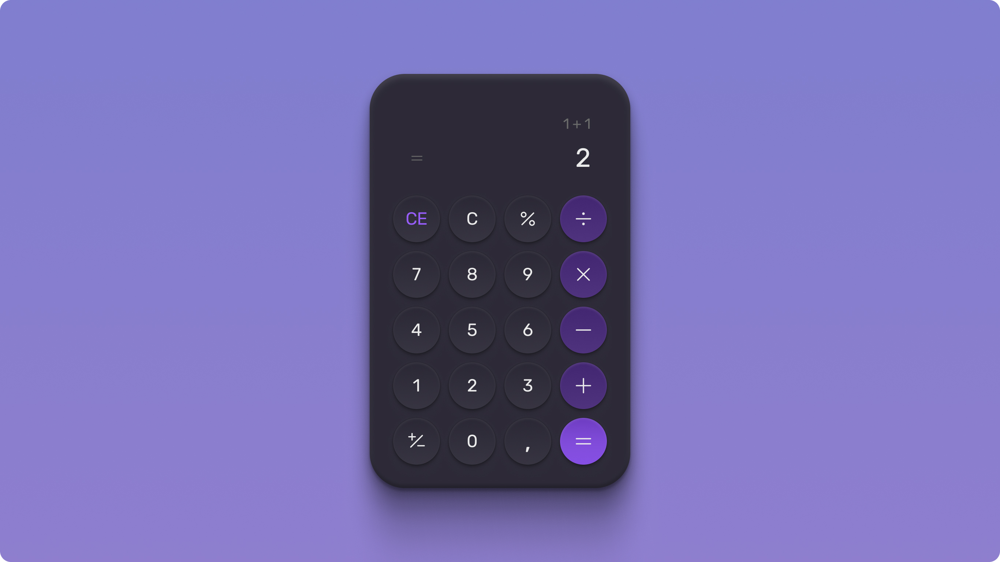

<h1 align="center"> #BoraCodar Calculadora </h1>

Evento exclusivo e gratuito, promovido pela Rocketseat para ensino de tecnologias WEB.

  <a href="#-tecnologias">Tecnologias</a>&nbsp;&nbsp;&nbsp;|&nbsp;&nbsp;&nbsp;
  <a href="#-projeto">Projeto</a>&nbsp;&nbsp;&nbsp;|&nbsp;&nbsp;&nbsp;
  <a href="#-layout">Layout</a>&nbsp;&nbsp;&nbsp;|&nbsp;&nbsp;&nbsp;
  <a href="#-licença">Licença</a>

  

 

  

## 🚀 Tecnologias

Esse projeto foi desenvolvido com as seguintes tecnologias:

- HTML e CSS
- JavaScript

## 💻 Projeto

O evento #BoraCodar disponibiliza cada semana um novo projeto, para fins de prática de conhecimentos de linguagens de programação como HTML, CSS e JavaScript.
Tendo como intuito servir de motivação para estudantes praticarem e aprofundarem suas técnicas. Após uma semana é publicado um vídeo com a resolução desse desafio. O desta semana era uma calculadora, eu a fiz, em cima de um antigo código de uma calculadora na qual eu ja tinha feito, refatorei adicionando funcionalidades novas, e aplicando técnicas de Clean Code, como renomeação de tags para mais fácil entendimento.
[Acesse o projeto nesse link](https://kauamntro.github.io/BoraCodar-Calculadora/)

## 🔖 Layout

Você pode visualizar o layout do projeto através [DESSE LINK](https://www.figma.com/community/file/1202607074523509182). 
É necessário ter conta no [Figma](https://figma.com) para acessá-lo.

## ⚖ Licença

Esse projeto está sob a licença MIT.

---

Feito com ♥ by Kauã e Rocketseat [Participe da comunidade Rocketseat](https://discord.gg/rocketseat)
